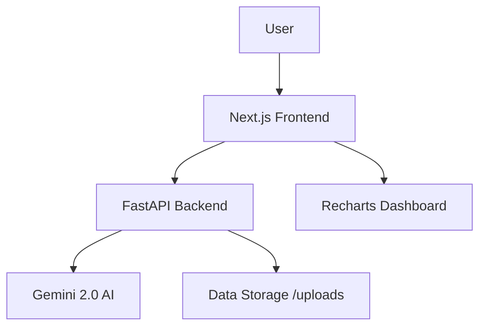

# 📊 AI Business Analytics Dashboard

An AI-powered business intelligence platform that transforms raw data into actionable insights. Upload your datasets, chat with an intelligent analyst, and visualize your business performance with interactive dashboards.

---

## 🚀 Key Features

- **🤖 AI-Powered Analytics**: Interact with your data using Gemini 2.0 Flash. Ask natural language questions and get deep business insights.
- **📈 Dynamic Visualizations**: Automatically generated Bar, Line, and Pie charts tailored to your data using Recharts.
- **📂 Flexible Data Support**: Seamlessly upload and process CSV and Excel (.xlsx, .xls) files.
- **⚡ Modern Tech Stack**: Built with a FastAPI backend for high-performance processing and a Next.js frontend for a sleek, responsive user experience.
- **🛠️ Automated Summarization**: Instant overview of numerical and categorical data upon upload.

---

## 🏗️ Architecture

The project is structured as a monorepo with a clear separation between frontend and backend.



---

## 🛠️ Tech Stack

### Backend
- **Framework**: [FastAPI](https://fastapi.tiangolo.com/)
- **AI Engine**: [Google Gemini 2.0 Flash](https://ai.google.dev/)
- **Data Processing**: [Pandas](https://pandas.pydata.org/), [NumPy](https://numpy.org/)
- **Server**: [Uvicorn](https://www.uvicorn.org/)

### Frontend
- **Framework**: [Next.js 15+](https://nextjs.org/) (React 19)
- **Styling**: Vanilla CSS / Tailwind CSS
- **Charts**: [Recharts](https://recharts.org/)
- **Icons**: [Lucide React](https://lucide.dev/)

---

## ⚙️ Getting Started

### Prerequisites
- Python 3.9+
- Node.js 18+
- Gemini API Key ([Get one here](https://aistudio.google.com/))

### 1. Backend Setup
```bash
cd backend
python -m venv venv
source venv/bin/activate  # Windows: venv\Scripts\activate
pip install -r requirements.txt
```
Create a `.env` file in the `backend/` directory:
```env
GEMINI_API_KEY=your_api_key_here
```
Run the server:
```bash
python main.py
```

### 2. Frontend Setup
```bash
cd frontend
npm install
npm run dev
```
Open [http://localhost:3000](http://localhost:3000) in your browser.

---

## 📂 Project Structure

```text
Business_Analytics/
├── backend/            # FastAPI source code & API endpoints
│   ├── src/            # Core logic & utilities
│   ├── uploads/        # Temporary storage for uploaded datasets
│   └── main.py         # Entry point for the backend server
├── frontend/           # Next.js frontend application
│   ├── src/            # Components, pages, and hooks
│   └── public/         # Static assets
└── README.md           # Project documentation
```

---

## 📄 License

This project is licensed under the MIT License - see the [LICENSE](LICENSE) file for details.

---

<p align="center">Made with ❤️ for Business Intelligence</p>